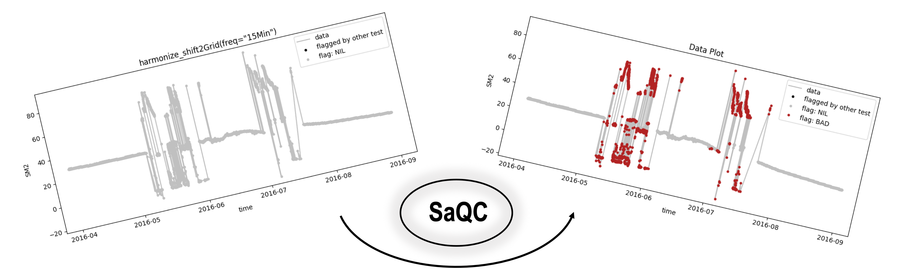

# System for automated Quality Control (SaQC)

Quality Control of numerical data requires a significant amount of domain knowledge and practical experience. Finding a robust setup of quality tests is usually a time-consuming and iterative
endeavor, even for experts.

SaQC is a Python-framework that addresses the explorative nature of quality control by offering a high degree of functionality as well as flexibility regarding its set-up and configuration. At the same time, it is easy-to-use: Most aspects of quality
control, like

+ test parametrization
+ test evaluation and 
+ test exploration 

are easy to configure in plain text files.

Below its userinterface, though, SaQC is highly customizable and extensible.
A modular structure and well-defined interfaces allow the extension with new quality check routines.
Additionally, many core components, like the flagging scheme, are exchangeable.

 

## Why?
When implementating data workflows in environmental
sciences, our experience as research data managers is that there is a significant
knowledge gap between the people that collect the data and those responsible for the processing and the
quality-control of these datasets.
While the former usually have a solid understanding of the underlying measurement
principles and the errors that might result from it, the latter are mostly software
developers with expertise in data processing.

The main objective of SaQC is to bridge this gap by allowing both
parties to focus on their strengths: The data collector/owner should be
able to express his/her ideas in an easy and succint way while the actual 
implementation of the data processing and quality-control is left to the 
respective developers.


## How?
The most import aspect of SaQC, the general configuration of the system,
is text-based. All the magic takes place in a semicolon-separated table file
listing the variables within the dataset to inspect, quality control and/or
modify.

 

While a good (but still growing) number of predefined and highly configurable
[functions](docs/FunctionDescriptions.md) are included and ready to use, SaQC
additionally ships with a python based
[extension language](saqc/docs/GenericTests.md). The extension language allows the user to define custom tests directly in the configuration text file. This way, cross-variable conditions can be implemented to identify erroneous measurements, e.g. "The measurement of my variable of interest is erroneous if the battery voltage of the measurement device drops below 12 volts".

For a more specific round trip to some of SaQC's possibilities, please refer to
our [GettingStarted](docs/GettingStarted.md).

## Installation

### pip
SaQC is available on the Python Package Index ([PyPI](https://pypi.org/)) and
can be installed using [pip](https://pip.pypa.io/en/stable/):
```sh
python -m pip install saqc
```

### Manual installation
The latest development version is directly available from the
[gitlab](https://git.ufz.de/rdm-software/saqc) server of the
[Helmholtz Center for Environmental Research](https://www.ufz.de/index.php?en=33573). 
All the dependenencies are listed [here](saqc/requirements.txt) and are easily
resolvable with:
```sh
python -m pip install -r requirements.txt
```
   
## Usage
### Command line interface (CLI)
SaQC provides a basic CLI to get you started. As soon as tha basic inputs, 
a dataset and the [configuration file](saqc/docs/Configuration.md) are prepared,
running SaQC is as simple as:
```sh
python -m saqc \
    --config path_to_configuration.txt \
    --data path_to_data.csv \
    --outfile path_to_output.csv
```


### Integration into larger workfows
The main function is [exposed](saqc/core/core.py#L79) and can be used in within 
your own programs. 


## License
Copyright(c) 2019, 
Helmholtz-Zentrum fuer Umweltforschung GmbH - UFZ. 
All rights reserved.

The "System for Automated Quality Control" is free software. You can 
redistribute it and/or modify it under the terms of the GNU General 
Public License as published by the free Software Foundation either 
version 3 of the License, or (at your option) any later version. See the
[license](license.txt) for detaily.

This program is distributed in the hope that it will be useful, but 
WITHOUT ANY WARRANTY; without even the implied warranty of 
MERCHANTABILITY or FITNESS FOR A PARTICULAR PURPOSE. 
See the GNU General Public License for more details.

