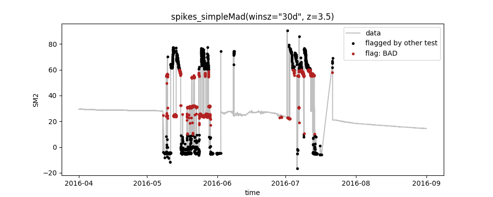
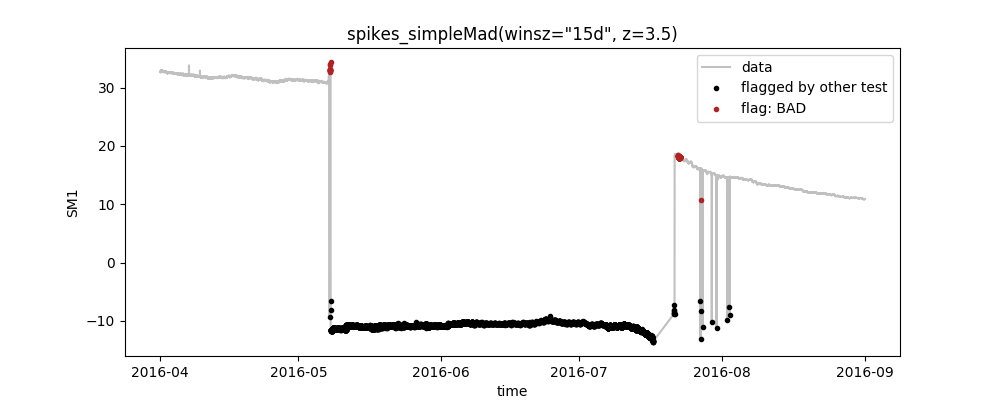
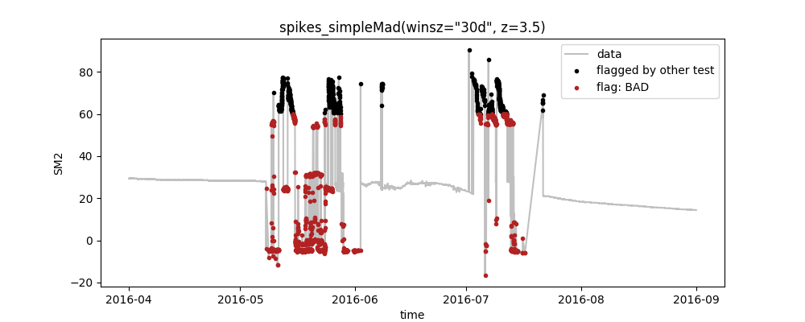
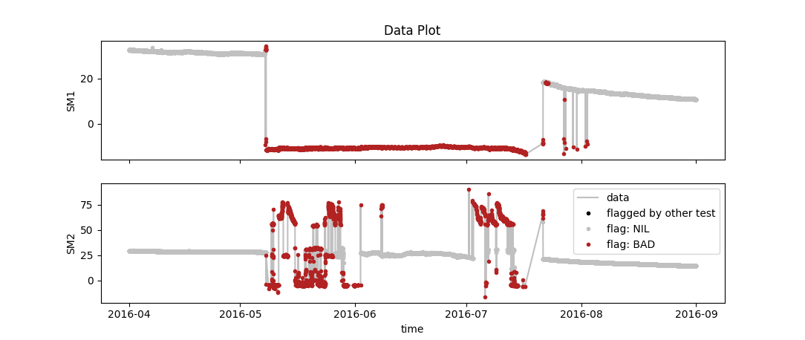

# Getting started with SaQC

This "getting started" assumes that you have Python of version 3.6 (or lower) installed.

## Contents

1. [Set up your environment](1-set-up-your-environment)
2. [Get SaQC](#2. Get SaQC)
3. [Training tour](#3. Training tour) 
	* [3.1 Get toy data and configuration](#3.1 Get toy data and configuration)
	* [3.2 Run SaQC](#3.2 Run SaQC)
	* [3.3 Configure SaQC](#3.3 Configure SaQC)
	* [3.4 Explore the functionality:](#3.4 Explore the functionality)
		* [Change test parameters](#Change test parameters)
		* [Process multiple variables](#Process multiple variables)
		* [Data harmonization and custom functions](#Data harmonization and custom functions)
		* [Save outputs to file](#Save outputs to file)

## 1. Set up your environment

SaQC is written in Python, so the easiest way to set up your system to use SaQC for your needs is using the Python Package Index (PyPI). Following good Python practice, you will first want to create a new virtual environment that you install SaQC into by typing the following in your console:
	
	# if you have not installed venv yet, do so:
	python3 -m pip install --user virtualenv
	
	# move to the directory where you want to create your virtual environment
	cd YOURDIR
	
	# create virtual environment called "env_saqc"
	python3 -m venv env_saqc
	
	# activate the virtual environment
	source env_saqc/bin/activate

Note that these instructions are for Unix/Mac-systems, the commands will be a little different for Windows.

## 2. Get SaQC

Now get saqc via PyPI as well:

	pip install saqc

or download it directly from the [GitLab-repository](https://git.ufz.de/rdm/saqc).

## 3. Training tour

The following passage guides you through the essentials of the usage of SaQC via a toy dataset and a toy configuration.

### 3.1 Get toy data and configuration

If you take a look into the folder *saqc/ressources/data* you will find a toy dataset *data.csv* which contains the following:

	Date,Battery,SM1,SM2
	2016-04-01 00:05:48,3573,32.685,29.3157
	2016-04-01 00:20:42,3572,32.7428,29.3157
	2016-04-01 00:35:37,3572,32.6186,29.3679
	2016-04-01 00:50:32,3572,32.736999999999995,29.3679
	...

These are two timeseries of soil moisture (SM1+2) and the battery voltage of the measuring device over time. Generally, this is the way that your data should look like to run saqc. Note, however, that you do not necessarily need a series of dates to reference to and that you are free to use more columns of any name that you like.

Now create your our own configuration file *saqc/ressources/data/myconfig.csv* and paste the following lines into it:
	
	varname;test;plot
	SM2;range(min=10, max=60);False
	SM2;spikes_simpleMad(winsz="30d", z=3.5);True

These lines illustrate how different quality control tests can be specified for different variables by following the pattern

*varname*|;| *testname (testparameters)*|;| *plotting option*|
:---------------|:------|:------|:----|:--|

In this case, we define a range-test that flags all values outside the range [10,60] and a test to detect spikes using the MAD-method. You can find an overview of all available quality control tests in the [documentation](FunctionDescriptions.md). Note that the tests are _executed in the order that you define in the configuration file_. The quality flags that are set during one test are always passed on to the subsequent one.

### 3.2 Run SaQC

Remember to have your virtual environment activated:

	source env_saqc/bin/activate

Via your console, move into the folder you downloaded saqc into:

	cd saqc

From here, you can run saqc and tell it to run the tests from the toy config-file on the toy dataset via the *-c* and *-d* options:

	python -m saqc -c ressources/data/myconfig.csv -d ressources/data/data.csv

Which will output this plot:

So, what do we see here?

* The plot shows the data as well as the quality flags that were set by the tests for the variable *SM2*, as defined in the config-file
* Following our definition in the config-file, first the *range*-test that flags all values outside the range [10,60] was executed and after that, the *spikes_simpleMad*-test to identify spikes in the data
*  In the config, we set the plotting option to *True* for *spikes_simpleMad*, only. Thus, the plot aggregates all preceeding tests (here: *range*) to black points and highlights the flags of the selected test as red points.

### 3.3 Configure SaQC

#### Change test parameters
Now you can start to change the settings in the config-file and investigate the effect that has on how many datapoints are flagged as "BAD". When using your own data, this is your way to configure the tests according to your needs. For example, you could modify your *myconfig.csv* and change the parameters of the range-test:
	
	varname;test;plot
	SM2;range(min=-20, max=60);False
	SM2;spikes_simpleMad(winsz="30d", z=3.5);True
Rerunning SaQC as above produces the following plot:

You can see that the changes that we made to the parameters of the range test take effect so that only the values >60 are flagged by it (black points). This, in turn, leaves more erroneous data that is then identified by the proceeding spike-test (red points).

### 3.4 Explore the functionality
#### Process multiple variables
You can also define multiple tests for multiple variables in your data. These are then executed sequentially and can be plotted seperately. E.g. you could do something like this:

	varname;test;plot
	SM1;range(min=10, max=60);False
	SM2;range(min=10, max=60);False
	SM1;spikes_simpleMad(winsz="15d", z=3.5);True
	SM2;spikes_simpleMad(winsz="30d", z=3.5);True

which gives you separate plots for each line where the plotting option is set to *True* as well as one summary "data plot" that depicts the joint flags from all tests:

SM1         |  SM2
:-------------------------:|:-------------------------:
  |  

#### Data harmonization and custom functions

SaQC includes functionality to harmonize the timestamps of one or more data series. Also, you can write your own tests using a python-based extension language. This would look like this:

	varname;test;plot
	SM2;harmonize_shift2Grid(freq="15Min");False
	SM2;generic,{func: (SM2 > 0)};True

The above executes an internal framework that harmonizes the timestamps of SM2 to a 15min-grid. Further information can be found in the [function definition](docs/FunctionDescriptions.md).

Also, all values where SM2 is below 0 are flagged via the custom function, see [here](docs/GenericTests.md) to learn about the syntax of these custom functions.

#### Save outputs to file
If you want the final results to be saved to a csv-file, you can do so by the use of the *-o* option:

	python -m saqc -c ressources/data/config.csv -d ressources/data/data.csv -o ressources/data/out.csv 

Which saves a dataframe that contains both the original data and the quality flags that were assigned by SaQC for each of the variables:

	Date,SM1,SM1_flags,SM2,SM2_flags
	2016-04-01 00:05:48,32.685,OK,29.3157,OK
	2016-04-01 00:20:42,32.7428,OK,29.3157,OK
	2016-04-01 00:35:37,32.6186,OK,29.3679,OK
	2016-04-01 00:50:32,32.736999999999995,OK,29.3679,OK
	...

