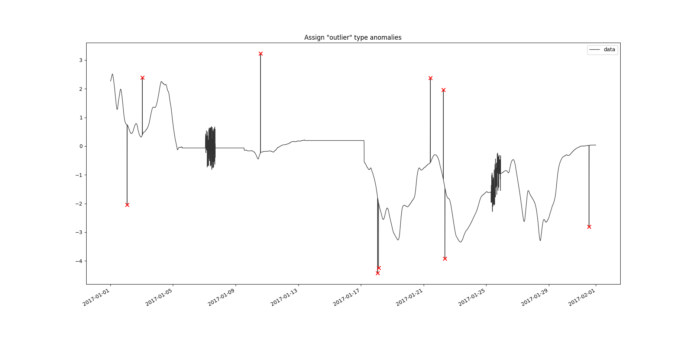
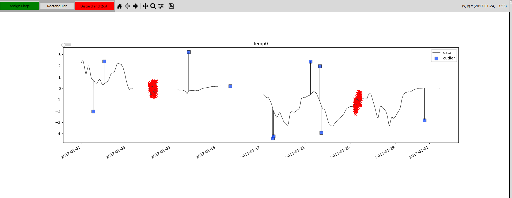

.. SPDX-FileCopyrightText: 2021 Helmholtz-Zentrum für Umweltforschung GmbH - UFZ
..
.. SPDX-License-Identifier: GPL-3.0-or-later

Calibrating Pipelines
=====================

The tutorial aims to introduce the calibration of flagging and data-filtering pipelines composed of SaQC methods.

Data Import
-----------

Load the example `data set <https://git.ufz.de/rdm-software/saqc/-/blob/develop/docs/resources/data/corruptedTemperature.csv>`_
from the *saqc* repository using the `pandas <https://pandas.pydata.org/>`_ CSV file reader.
Then, create an :py:class:`~saqc.SaQC` instance from the data and generate a plot using the :py:meth:`~saqc.SaQC.plot` method.

.. plot::
   :context: reset
   :include-source: False

   import matplotlib
   import saqc
   import pandas as pd
   data = pd.read_csv('../resources/data/corruptedTemperature.csv', index_col=0, parse_dates=[0])
   qc = saqc.SaQC(data)

.. doctest:: calibrateExample

   >>> import saqc
   >>> data = pd.read_csv('./resources/data/corruptedTemperature.csv', index_col=0, parse_dates=[0])
   >>> qc = saqc.SaQC(data)
   >>> qc.plot(['temp0', 'temp1'], mode='subplots') # doctest: +SKIP

.. plot::
   :context: close-figs
   :include-source: False
   :class: center

    qc.plot(['temp0', 'temp1'], mode='subplots')

Calibrate Single Type Pipeline
------------------------------

To calibrate a pipeline that specifically targets the outliers in the data, we need
some example outliers, the pipeline can be trained on. Those examples can be generated
using the :py:meth:`~saqc.SaQC.supervise` method.

To calibrate a pipeline that specifically targets outliers in the data, we need examples of outliers on which the
pipeline can be trained. These examples can be marked using the :py:meth:`~saqc.SaQC.supervise` method.

We dont need to work through the whole year of available data. Identifying outliers in January should suffice.

So, :py:attr:`data_start` and :py:attr:`end_date` are set to `2017-01-01` and `2017-02-01`.
The label we want to associate with the assignment, would be `'outliers'` (as we identify outliers), which we assign
to the :py:attr:`label` keyword.

.. doctest:: calibrateExample

   >>> qc = qc.flagByClick('temp0', gui_mode='overlay', label='outliers', start_date='2017-01-01', end_date='2017-02-01') # doctest: +SKIP

.. plot::
   :context: close-figs
   :include-source: False
   :class: center
   :caption: Supervision GUI.

   >>> qc = qc.flagByClick('temp0', gui_mode='overlay', label='outliers', start_date='2017-01-01', end_date='2017-02-01')

One can add values to the selection of calibration targets with the rectangle selector by
right-clicking, holding and dragging over the outlierish values. Doing the same with a *left-click*,
does remove points from the selection again:

By clicking the *Assign Flags* button, the assignment is approved of and carried out.
Now, a flagging method can be calibrated with that assignment.
Calibration should be confined to the same time frame as supervision. That is why we pass on, the
same values to :py:attr:`end_date` and :py:attr:`end_date` as above.

As we labeled the targets of the calibration `'outliers'`, the parameter :py:attr:`problem_labels` is
assigned the single element list `['outliers']` again.

To determine the method that gets calibrated to the target, we assign a list of methods to :py:attr:`problems`.
Since we specifically target values exceeding local standard scattering (=*outliers*), we assign the
outlier calibration `'outliers'`.

Finally, we assign the resulting, calibrated function a name via the :py:attr:`name` parameter.

.. doctest:: calibrateExample

   >>> qc.calibratePipeline('temp0', name='calibratedOutlierDetector', problems=['outliers'], problem_labels=['outliers'], start_date='2017-01-01', end_date='2017-02-01') # doctest: +SKIP

After the calibration is completed, the so calibrated function can be accessed as a usual method by the assigned
:py:attr:`name` value. We apply the calibrated function and plot the flagging result:

.. doctest:: calibrateExample

   >>> qc.calibratedOutlierDetector('temp0').plot('temp0') # doctest: +SKIP

.. plot::
   :context: close-figs
   :include-source: False
   :class: center

   >>> qc.applyConfig('temp0', path='../resources/data/temp0config.csv').plot('temp0')

To make available the calibrated function for future sessions or integrate it with automated pipeline
setups, optimal parameters and configuration file can be logged to a folder, by assigning its path
the parameter :py:attr:`log_path`. Lets do this for the second variable. As the data wasnt supervised,
the supervision GUI will be called on the fly, so we can skip the call of :py:attr:`supervise`.

.. doctest:: calibrateExample

   >>> qc.calibratePipeline('temp1', problems=['outliers'], problem_labels=['outliers'], start_date='2017-01-01', end_date='2017-02-01', log_path=PATH) # doctest: +SKIP

The configuration file will be stored to "`PATH`\config.csv" and can be loaded (and applied to :py:attr:`field`) via
the :py:attr:`applyConfig` Method:

.. doctest:: calibrateExample

   >>> qc.applyConfig('temp1', path=PATH + '/config.csv').plot('temp1') # doctest: +SKIP

.. plot::
   :context: close-figs
   :include-source: False
   :class: center

   >>> qc.applyConfig('temp1', path='../resources/data/temp1config.csv').plot('temp1')

To calibrate a pipeline that targets both, the outlier values and also the noise, we can add
flags withs a noise label:

.. doctest:: calibrateExample

   >>> qc = qc.flagByClick('temp0', label='noise', gui_mode='overlay', start_date='2017-01-01', end_date='2017-02-01') # doctest: +SKIP

To run a pipeline that catches both the anomaly types, we sequentially calibrate a :py:attr:`noise` problem, targeting the
`'noise'`-labeled flags and than - again, the :py:attr:`outliers` pipeline to the `'outliers'`-labeled data.

This - of course could be done by subsequentially calling:

1. `qc.calibratePipeline('temp0', problems=['noise'], problem_labels=['noise'], start_date='2017-01-01', end_date='2017-02-01', name='noiseFilter')`
2. `qc.calibratePipeline('temp0', problems=['outliers'], problem_labels=['outliers'], start_date='2017-01-01', end_date='2017-02-01', log_path=PATH, name='outlierFilter')`

Which would result in 2 new methods, `'noiseFilter'` and `'outlierFilter'`. To do the calibration
in one call and also in order to generate a method/configuration file that does target both anomaly types in one go,
we can also do:

.. doctest:: calibrateExample

   >>> qc.calibratePipeline('temp0', name='anomalyDetector', problems=['noise', 'outliers'], problem_labels=['noise','outliers'], start_date='2017-01-01', end_date='2017-02-01', log_path=PATH) # doctest: +SKIP

Subsequently, just calling the newly generated method `'anomalyDetector'` on any field,
like so: ``qc.anomalyDetector('temp0')``, will filter it for both the exemplified anomaly patterns.

