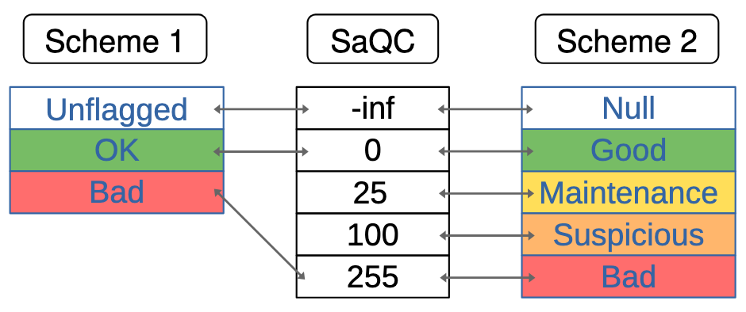

.. SPDX-FileCopyrightText: 2021 Helmholtz-Zentrum für Umweltforschung GmbH - UFZ
..
.. SPDX-License-Identifier: GPL-3.0-or-later

.. _FlagsHistoryTranslations:

Flags, Flagging Schemes and Histories
=====================================

Flags
-----

Flags, or more formally *quality annotations*, are SaQC’s mechanism for
representing data quality. Flags are observation-based, meaning that each
individual observation of a time series has an associated quality value.

SaQC distinguishes between two layers of flag representation: an internal
representation and an external representation.

.. _internal_flags:

Internal Representation
~~~~~~~~~~~~~~~~~~~~~~~

The internal representation of flags is stored in the attribute
:py:attr:`saqc._flags`. All flags associated with a given ``field`` can be accessed
via::

    saqc._flags[field]

The internal representation is chosen solely for reasons of internal
semantics and technical considerations. It is **not intended for direct
user interaction**.

Internally, flags are stored as floating-point values that are numerically
ordered. A higher numeric flag value has precedence over lower flag values.

Two special flag values are of particular interest:

.. _internal_flag_unflagged:

``-np.inf``
    Represents the absence of a flag. An observation flagged with
    ``-np.inf`` has not been quality controlled and must be considered
    unchecked.

.. _internal_flag_anomaly:

``255.0``
    Represents the default flag denoting a detected anomaly.
    Observations flagged with ``255.0`` were marked as anomalous by at
    least one QC function. Such observations are excluded from all other
    QC functions executed on the time series (see :ref:`filtering`).

.. _external_flags:

External Representation
~~~~~~~~~~~~~~~~~~~~~~~

The external representation of flags is stored in the attribute
:py:attr:`saqc.flags`. To access all flags associated with a time series,
subset the data structure accordingly::

    saqc.flags[field]

The external representation is derived from the internal representation
through a *translation*. A translation is implemented by a specific
:ref:`Flagging Scheme <flagging_schemes>` and defines the mapping to and
from the internal representation.

Depending on the chosen flagging scheme, flags may appear in different
forms. These schemes are described in more detail in the corresponding
section.

.. _flagging_schemes:

Flagging Schemes and Translations
---------------------------------

A flagging scheme describes a coherent set of
:ref:`external flags <external_flags>`, their interrelation, and the
bidirectional translation between :ref:`internal flags <internal_flags>` and
:ref:`external flags <external_flags>`.

The translation between internal and external flags is performed
implicitly whenever the attribute :py:attr:`saqc.flags` is accessed or when
external flags are passed to a SaQC function (e.g., via the global keyword
arguments ``dfilter`` and ``flag``).

A flagging scheme is part of the SaQC context and, as such, an attribute of
the :py:class:`SaQC` class. A scheme can either be provided during initialization of
a :py:class:`SaQC` object using the keyword argument ``scheme``
(``SaQC(..., scheme="simple")``) or by setting the attribute
:py:attr:`SaQC.scheme` directly.

:numref:`quality_labels` illustrates the translation between two exemplary
flagging schemes and the internal representation.

.. _quality_labels:

   Translation between the Flagging Schemes ``Scheme 1``, ``Scheme 2`` and the internal
   flag representation ``SaQC``.

Currently, three different flagging schemes are provided:

1. :py:class:`FloatScheme`

   The default flagging scheme closely resembles the
   :ref:`internal flags <internal_flags>` and operates directly on the
   internal floating-point flag representation.

   - ``-numpy.nan`` denotes that an observation is unchecked.
   - ``-numpy.inf`` indicates that an observation has been checked by at
     least one SaQC function but no anomaly was detected.
   - ``255.0`` annotates anomalous observations.

   All other flag values may be used freely. Flag values greater than or
   equal to ``255.0`` are subject to SaQC's
   :ref:`filtering mechanism <filtering>`.

   To explicitly select the :py:class:`FloatScheme`, either use the class directly
   or its string alias ``"float"``, e.g.::

       SaQC(..., scheme=FloatScheme())
       SaQC(..., scheme="float")

   To change the scheme after initialization, assign it directly::

       qc.scheme = "float"
       qc.scheme = FloatScheme()

2. :py:class:`AnnotatedFloatScheme`

   Implements the same flagging logic as the :py:class:`FloatScheme` but augments
   the flag representation with detailed information about the SaQC
   function that produced the flag, including its name and the concrete
   arguments used.

3. :py:class:`SimpleScheme`

   The simplest available flagging scheme. It provides only three literal
   flags:

   - ``"UNFLAGGED"`` indicates that an observation has not been checked.
   - ``"BAD"`` indicates that at least one executed SaQC function marked the
     observation as anomalous.
   - ``"OK"`` indicates that an observation was checked by at least one SaQC
     function and no anomaly was detected.

Histories
---------

During the execution of a quality control pipeline, multiple flags may be
assigned to each observation of a time series. In general, each QC function
produces its own set of flags. In the following example, one "layer" of flags
for the field ``"f1"`` is created by each of the executed SaQC functions
:py:meth:`flagRange`, :py:meth:`flagConstants` and :py:meth:`flagUniLOF`:

.. code-block:: python

    (qc
       .flagRange(field="f1", min=0, max=100)
       .flagConstants(field="f1", thresh=0, window="2h")
       .flagUniLOF(field="f1"))

These successive flag assignments are stored as separate layers within a data
structure called the :py:class:`History`.

By default, the final visible flag for an observation is obtained by selecting
the last non-null flag assigned to that observation. Alternatively, it is
possible to aggregate by selecting either the lowest or the highest flag value.
Changes to the default behavior can be made by setting the module-level
constant :py:attr:`saqc.core.history.AGGREGATION` to one of the following string
values: ``"last"``, ``"min"``, or ``"max"``.

Every field in a SaQC dataset stores its own ``History``, accessible via::

    qc._history[field]

A :py:class:`History` consists of two components:

1. A :py:class:`pandas.DataFrame` with the same index as the associated time series
   and one column per executed QC function (three in the example above).
   Each additional SaQC function execution adds another column to this
   :py:class:`DataFrame`.

2. A list of Python dictionaries storing metadata about the executed
   functions (e.g., function name and parameters). The list is position-based,
   meaning that the first entry corresponds to the first :py:class:`History` column,
   which in turn corresponds to the first executed SaQC function.

This mechanism provides the possibility to enrich the
:ref:`external flags <external_flags>` generated in the
:ref:`flagging scheme <flagging_schemes>` with observation-level metadata
and provenance information.

.. _filtering:

Filtering
---------

SaQC takes existing flags into account through a mechanism called
*filtering*. By default, all observations of a given time series that are
already flagged are masked before a SaQC function is executed.

Masking is implemented by temporarily replacing the corresponding
observational values with ``numpy.nan``. More precisely, a value :math:`v`
with associated flag :math:`f(v)` is masked if :math:`f(v) \geq`
``dfilter``.
All SaQC functions are designed to ignore these null values during
computation. This means that such values are excluded from most arithmetic
calculations, but may still be implicitly considered in certain operations,
such as counting the number of observations or performing ``nan`` checks.
After the function has completed, the original values are restored.

The masking behaviour can be influenced in two ways:

1. ``dfilter`` function argument

   The globally available SaQC function parameter ``dfilter`` defines the
   filtering threshold. All observations with flag values greater than or
   equal to the specified ``dfilter`` level are masked prior to execution
   of the function.

2. ``DFILTER_DEFAULT`` flagging scheme constant

   Each :ref:`flagging scheme <flagging_schemes>` defines a constant
   ``DFILTER_DEFAULT`` that specifies the default filtering threshold.
   This value is used whenever no explicit ``dfilter`` argument is
   provided.

   Setting ``DFILTER_DEFAULT`` to the global constant ``FILTER_NONE``
   (associated with the value ``numpy.inf``) disables the filtering
   mechanism globally.
