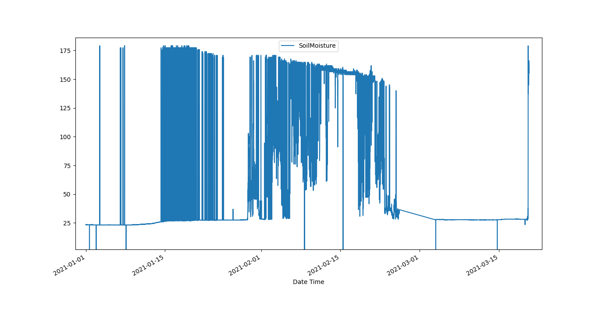

# Data Regularisation

The tutorial aims to introduce the usage of `SaQC` methods in order to obtain regularly sampled data derivates.
from given timeseris data input. Regularly sampled timeseries data, is data, that has constant temporal spacing between subsequent 
datapoints.

## Data

Usually, meassurement data does not come in regularly sampled timeseries. The reasons on the other hand, why one would
like to have timeseries data, that exhibits a constant temporal gap size
in between subsequent meassurements, are manifold. 
The 2 foremost important ones, may be, that statistics, such as mean and standard deviation 
usually presupposes the set of data points, they are computed of, to
be of "equal" weights.
The second reason is, that, relating data of different sources to another, is impossible, if one
has not a mapping at hand, that relates the different meassurement times to each other.

The following [dataset](../ressources/data/SoilMoisture.csv) of Soil Moisture meassurements may serve as 
explainatory data:



Lets import it via:

```python
import pandas as pd
data = pd.read_csv(data_path, col_index=1)
data.index = pd.DatetimeIndex(data.index)
```

Now lets check out the data s timestamps

```python
>>> data
                     SoilMoisture
Date Time                        
2021-01-01 00:09:07     23.429701
2021-01-01 00:18:55     23.431900
2021-01-01 00:28:42     23.343100
2021-01-01 00:38:30     23.476400
2021-01-01 00:48:18     23.343100
                           ...
2021-03-20 07:13:49    152.883102
2021-03-20 07:26:16    156.587906
2021-03-20 07:40:37    166.146194
2021-03-20 07:54:59    164.690598
2021-03-20 08:40:41    155.318893
[10607 rows x 1 columns]

```

So, the data seems to start with an intended sampling rate of about *10* minutes. Where, at the end, the interval seems to 
have changed to somewhat *15* minutes. Finding out about the proper sampling a series should be regularized to is a
a subject that wont be covered here. Usually the intended sampling rate of sensor data is known from the specification.
If thats not the case, and if there seem to be more than one candidates, a rough rule of thumb to mitigate data loss, 
may be to go for the smallest rate.

So lets transform the meassurements timestamps to have a regular *10* minutes frequency. In order to do so, 
we have to decide what to do with the associated data points. 

Basically there are three possibilities: We could keep the values as they are, and thus, 
just [shift](#Shift) them in time to match the equidistant *10* minutes frequency grid. Or, we could calculate new, 
synthetic meassurement values for the regular timestamps, via an [interpolation](#Interpolation) method. Or we could
apply some [aggregation](#Resampling) to up- or downsample the data. 

## Shift

Lets apply a simple shift via the :py:func:`saqc.shift <Functions.saqc.shift>` method.

```python
saqc = saqc.shift('SoilMoisture', target='SoilMoisture_bshift', freq='10min', method='bshift')
```

* We selected a new target field to store the shifted data to, to not override our original data.
* We passed the `freq` keyword of the intended sampling frequency in terms of a 
[date alias](https://pandas.pydata.org/pandas-docs/stable/user_guide/timeseries.html#offset-aliases) string. 
* With the `method` keyword, we determined the direction of the shift. We passed it the string `bshift` - 
which applies a *backwards* shift, so meassurements get shifted backwards, until they match a timestamp
that is a multiple of *10* minutes. (See :py:func:`saqc.shift <Functions.saqc.shift>` documentation for more
details on the keywords.) 
  
Lets see how the data is now sampled. Therefore, we use the `raw` output from the 
:py:meth:`saqc.getResult <saqc.core.core.SaQC>` method. This will prevent the methods output from
being merged to a `pandas.DataFrame` object and the changes from the resampling will be easier 
comprehendable from one look.:

```python
>>> saqc = saqc.evaluate()
>>> data_serult = saqc.getResult(raw=True)[0]
>>> data_result

                    SoilMoisture |                       SoilMoisture_bshift | 
================================ | ========================================= | 
Date Time                        | Date Time                                 | 
2021-01-01 00:00:00    23.429701 | 2021-01-01 00:09:07             23.429701 | 
2021-01-01 00:10:00    23.431900 | 2021-01-01 00:18:55             23.431900 | 
2021-01-01 00:20:00    23.343100 | 2021-01-01 00:28:42             23.343100 | 
2021-01-01 00:30:00    23.476400 | 2021-01-01 00:38:30             23.476400 | 
2021-01-01 00:40:00    23.343100 | 2021-01-01 00:48:18             23.343100 | 
2021-01-01 00:50:00    23.298800 | 2021-01-01 00:58:06             23.298800 | 
2021-01-01 01:00:00    23.387400 | 2021-01-01 01:07:54             23.387400 | 
2021-01-01 01:10:00    23.343100 | 2021-01-01 01:17:41             23.343100 | 
2021-01-01 01:20:00    23.298800 | 2021-01-01 01:27:29             23.298800 | 
2021-01-01 01:30:00    23.343100 | 2021-01-01 01:37:17             23.343100 | 
                          ... | ...                                   ... | 
2021-03-20 07:20:00   156.587906 | 2021-03-20 05:07:02            137.271500 | 
2021-03-20 07:30:00          NaN | 2021-03-20 05:21:35            138.194107 | 
2021-03-20 07:40:00   166.146194 | 2021-03-20 05:41:59            154.116806 | 
2021-03-20 07:50:00   164.690598 | 2021-03-20 06:03:09            150.567505 | 
2021-03-20 08:00:00          NaN | 2021-03-20 06:58:10            145.027496 | 
2021-03-20 08:10:00          NaN | 2021-03-20 07:13:49            152.883102 | 
2021-03-20 08:20:00          NaN | 2021-03-20 07:26:16            156.587906 | 
2021-03-20 08:30:00          NaN | 2021-03-20 07:40:37            166.146194 | 
2021-03-20 08:40:00   155.318893 | 2021-03-20 07:54:59            164.690598 | 
[11286]                            [10607]     
```
We see the first and last *10* datapoints of both, the original data timeseries and the shifted one.

Obveously, the shifted data series now exhibits a regular sampling rate of *10* minutes, with the index
ranging from the latest timestamp, that is a multiple of *10* minutes and preceeds the initial timestamp
of the original data, up to the first *10* minutes multiple, that succeeds the last original datas timestamp.
This is default behavior to all the :doc:`regularisations <../Functions/regularisation>` provided by `saqc`.

The number of datapoints  (displayed at the bottom of the table columns) has changed through the
transformation as well. That change stems from 2 sources mainly:

Firstly, if there is no [valid](#valid-data) data point available within an interval of the passed frequency, that could be shifted to match a multiple
of the frequency, a `NaN` value gets inserted to represent the fact, that at this position there is data missing.

Second, if there are multiple values present, within an interval with size according to the passed `freq`, this values
get reduced to one single value, that will get associated with the intervals timestamp.

This reduction depends on the selected :doc:`regularisation <../Functions/regularisation>` method.

We applied a backwards :py:func:`shift <Functions.saqc.shift>` with a *10* minutes frequency,
so the the first value, encountered after any multiple of *10* minutes, gets shifted backwards to be aligned with
the desired frequency and any other value in that *10* minutes interval just gets discarded.

See the below chunk of our processed *SoilMoisture* data set to get an idea of the effect. There are 2 meassurements
within the *10* minutes interval ranging from `2021-01-01 07:30:00` to `2021-01-01 07:40:00` present
in the original data - and only the first of the two reappears in the shifted data set, as representation
for that interval.

```python
>>> data_result['2021-01-01T07:00:00':'2021-01-01T08:00:00']

             SoilMoisture_bshift |                              SoilMoisture |
================================ | ========================================= |
Date Time                        | Date Time                                 |
2021-01-01 07:00:00      23.3431 | 2021-01-01 07:00:41               23.3431 |
2021-01-01 07:10:00      23.3431 | 2021-01-01 07:10:29               23.3431 |
2021-01-01 07:20:00      23.2988 | 2021-01-01 07:20:17               23.2988 |
2021-01-01 07:30:00      23.3874 | 2021-01-01 07:30:05               23.3874 |
2021-01-01 07:40:00      23.3431 | 2021-01-01 07:39:53               23.3853 |
2021-01-01 07:50:00      23.3874 | 2021-01-01 07:49:41               23.3431 |
```

Notice, how, for example, the data point for `2021-01-01 07:49:41` gets shifted all the way back, to 
`2021-01-01 07:40:00` - although, shifting it forward to `07:40:00` would be less a manipulation, since this timestamp
appears to be closer to the original one. 

To shift to any frequncy aligned timestamp the value that is closest to that timestamp, we
can perform a *nearest shift* instead of a simple *back shift*, by using the shift method `"nshift"`:

```python
>>> saqc = saqc.shift('SoilMoisture', target='SoilMoisture_nshift', freq='10min', method='nshift')
>>> saqc = saqc.evaluate()
>>> data_result = saqc.getResult(raw=True)[0]
>>> data_result['2021-01-01T07:00:00':'2021-01-01T08:00:00']

             SoilMoisture_nshift |                              SoilMoisture | 
================================ | ========================================= | 
Date Time                        | Date Time                                 | 
2021-01-01 07:00:00      23.3431 | 2021-01-01 07:00:41               23.3431 | 
2021-01-01 07:10:00      23.3431 | 2021-01-01 07:10:29               23.3431 | 
2021-01-01 07:20:00      23.2988 | 2021-01-01 07:20:17               23.2988 | 
2021-01-01 07:30:00      23.3874 | 2021-01-01 07:30:05               23.3874 | 
2021-01-01 07:40:00      23.3853 | 2021-01-01 07:39:53               23.3853 | 
2021-01-01 07:50:00      23.3431 | 2021-01-01 07:49:41               23.3431 | 
```

Now, any timestamp got assigned, the value that is nearest to it, *if* there is one valid data value available in the
interval surrounding that timestamp with a range of half the frequency. In our example, this would mean, the regular 
timestamp would get assigned the nearest value of all the values, that preceed or succeed it by less than *5* minutes. 
Maybe check out, what happens with the chunk of the final 2 hours of our shifted *Soil Moisture* dataset to get an idea.

```python
>>> data_result['2021-03-20 07:00:00']


             SoilMoisture_nshift |                              SoilMoisture | 
================================ | ========================================= | 
Date Time                        | Date Time                                 | 
2021-03-20 07:00:00   145.027496 | 2021-03-20 07:13:49            152.883102 | 
2021-03-20 07:10:00   152.883102 | 2021-03-20 07:26:16            156.587906 | 
2021-03-20 07:20:00          NaN | 2021-03-20 07:40:37            166.146194 | 
2021-03-20 07:30:00   156.587906 | 2021-03-20 07:54:59            164.690598 | 
2021-03-20 07:40:00   166.146194 | 2021-03-20 08:40:41            155.318893 | 
2021-03-20 07:50:00   164.690598 | 2021-03-20 08:40:41            155.318893 | 
2021-03-20 08:00:00          NaN |                                           | 
2021-03-20 08:10:00          NaN |                                           | 
2021-03-20 08:20:00          NaN |                                           | 
2021-03-20 08:30:00          NaN |                                           | 
2021-03-20 08:40:00   155.318893 |                                           | 
2021-03-20 08:50:00          NaN |                                           | 
```

Since there is no valid data available, for example, in the interval from `2021-03-20 07:55:00` to `2021-03-20 08:05:00` - the new value 
for the regular timestamp `2021-03-20 08:00:00`, that lies in the center of this interval, is `NaN`. 

## aggregation freq=20 Hz (resample)

If we want to comprise several values by aggregation and assign the result to the new regular timestamp, instead of
selecting a single one, we can do this, with the :py:func:`saqc.resample <Functions.saqc.resample>` method.
Lets resample the *SoilMoisture* data to have a *20* minutes sample rate by aggregating every *20* minutes intervals
content with the arithmetic mean (which is implemented by numpies `numpy.mean` function for example).

```python
>>> import numpy
>>> saqc = saqc.resample('SoilMoisture', target='SoilMoisture_mean', freq='20min', method='bagg', agg_func=np.mean)
>>> saqc = saqc.evaluate()
saqc.getResult(raw=True)[0]

                    SoilMoisture |                     SoilMoisture_mean | 
================================ | ===================================== | 
Date Time                        | Date Time                             | 
2021-01-01 00:09:07    23.429701 | 2021-01-01 00:00:00         23.430800 | 
2021-01-01 00:18:55    23.431900 | 2021-01-01 00:20:00         23.409750 | 
2021-01-01 00:28:42    23.343100 | 2021-01-01 00:40:00         23.320950 | 
2021-01-01 00:38:30    23.476400 | 2021-01-01 01:00:00         23.365250 | 
2021-01-01 00:48:18    23.343100 | 2021-01-01 01:20:00         23.320950 | 
2021-01-01 00:58:06    23.298800 | 2021-01-01 01:40:00         23.343100 | 
2021-01-01 01:07:54    23.387400 | 2021-01-01 02:00:00         23.320950 | 
2021-01-01 01:17:41    23.343100 | 2021-01-01 02:20:00         23.343100 | 
2021-01-01 01:27:29    23.298800 | 2021-01-01 02:40:00         23.343100 | 
2021-01-01 01:37:17    23.343100 | 2021-01-01 03:00:00         23.343100 | 
                          ... | ...                               ... | 
2021-03-20 05:07:02   137.271500 | 2021-03-20 05:40:00        154.116806 | 
2021-03-20 05:21:35   138.194107 | 2021-03-20 06:00:00        150.567505 | 
2021-03-20 05:41:59   154.116806 | 2021-03-20 06:20:00               NaN | 
2021-03-20 06:03:09   150.567505 | 2021-03-20 06:40:00        145.027496 | 
2021-03-20 06:58:10   145.027496 | 2021-03-20 07:00:00        152.883102 | 
2021-03-20 07:13:49   152.883102 | 2021-03-20 07:20:00        156.587906 | 
2021-03-20 07:26:16   156.587906 | 2021-03-20 07:40:00        165.418396 | 
2021-03-20 07:40:37   166.146194 | 2021-03-20 08:00:00               NaN | 
2021-03-20 07:54:59   164.690598 | 2021-03-20 08:20:00               NaN | 
2021-03-20 08:40:41   155.318893 | 2021-03-20 08:40:00        155.318893 |
[10607]                            [5643]                            
```

You can pass arbitrary function objects to the `agg_func` parameter, to be applied to calculate every intervals result,
as long as this function returns a scalar *float* value upon an array-like input. (So `np.median` would be propper
for calculating the median, `sum`, for assigning the value sum, and so on.)

As it is with the [shift](#shift) functionality, a `method` keyword controlls, weather the 
aggregation result of the interval in between 2 regular timestamps gets assigned to the left (=`bagg`) or to the
right (`fagg`) boundary timestamp.

Also, analogous to to the shift functionality, intervals of size `freq`, that do 
not contain any [valid](#valid) data that could be aggregated, get `ǹp.nan` assigned. 

### valid

Note, that not only missing and `ǹp.nan` values are considered *not valid*, but flagged data as well.
So, to exclude certain values from the aggregation, flagging them before resampling
will effectively remove them from the resampling process. See chapter 
[flagging and resampling](#flagging-and-resampling).

## interpolation 

Another common way of obtaining regular timestamps, is, the interpolation of data at regular timestamps.
In the pool of :doc:`regularisation <function_cats/regularisation>` methods, is available the 
:py:func:`saqc.interpolate <Functions.saqc.interpolate>` method.

Lets apply a linear interpolation onto the dataset. To access
linear interpolation, we pass the `method` parameter the string `"time"`. This 
applies an interpolation, that is sensitive to the difference in temporal gaps
(as opposed by `"linear"`, wich expects all the gaps to be equal). Get an overview
of the possible interpolation methods in the :py:func:`saqc.interpolate <Functions.saqc.interpolate>`
documentation. Lets check the results:

```python
>>> saqc = saqc.interpolate('SoilMoisture', target='SoilMoisture_linear', freq='10min', method='time')
>>> saqc = saqc.evaluate()
>>> saqc.getResult()[0]

                    SoilMoisture |                       SoilMoisture_linear | 
================================ | ========================================= | 
Date Time                        | Date Time                                 | 
2021-01-01 00:00:00          NaN | 2021-01-01 00:09:07             23.429701 | 
2021-01-01 00:10:00    23.429899 | 2021-01-01 00:18:55             23.431900 | 
2021-01-01 00:20:00    23.422067 | 2021-01-01 00:28:42             23.343100 | 
2021-01-01 00:30:00    23.360782 | 2021-01-01 00:38:30             23.476400 | 
2021-01-01 00:40:00    23.455997 | 2021-01-01 00:48:18             23.343100 | 
2021-01-01 00:50:00    23.335415 | 2021-01-01 00:58:06             23.298800 | 
2021-01-01 01:00:00    23.315977 | 2021-01-01 01:07:54             23.387400 | 
2021-01-01 01:10:00    23.377891 | 2021-01-01 01:17:41             23.343100 | 
2021-01-01 01:20:00    23.332627 | 2021-01-01 01:27:29             23.298800 | 
2021-01-01 01:30:00    23.310176 | 2021-01-01 01:37:17             23.343100 | 
                          ... | ...                                   ... | 
2021-03-20 07:20:00   154.723105 | 2021-03-20 05:07:02            137.271500 | 
2021-03-20 07:30:00          NaN | 2021-03-20 05:21:35            138.194107 | 
2021-03-20 07:40:00          NaN | 2021-03-20 05:41:59            154.116806 | 
2021-03-20 07:50:00   165.195497 | 2021-03-20 06:03:09            150.567505 | 
2021-03-20 08:00:00          NaN | 2021-03-20 06:58:10            145.027496 | 
2021-03-20 08:10:00          NaN | 2021-03-20 07:13:49            152.883102 | 
2021-03-20 08:20:00          NaN | 2021-03-20 07:26:16            156.587906 | 
2021-03-20 08:30:00          NaN | 2021-03-20 07:40:37            166.146194 | 
2021-03-20 08:40:00          NaN | 2021-03-20 07:54:59            164.690598 |                             
2021-03-20 08:50:00          NaN | 2021-03-20 08:40:41            155.318893 |
[11286]                            [10607]                                     
```

The regularisation by interpolation is strict in the sence, that regular timestamps *only* get 
interpolated, if they have at least one [valid](#valid) data value preceeding them *and* one
succeeding them *within* the given frequency range (wich is controlled by `freq` keyword.).

Thats why, you have no interpolation value at `2021-03-20 07:30:00` - since it is preceeded
by a [valid](#valid) value at `2021-03-20 07:26:16`, but there is no [valid](#valid) value
available in between the succeeding *10* minutes interval from `2021-03-20 07:30:00` to `2021-03-20 07:30:00`.

On the other hand, there is an interpolated value assigned to `2021-03-20 07:50:00`, it is preceeded by
a [valid](#valid) value at `2021-03-20 07:40:37` and one succeeding at `2021-03-20 07:54:59`.

This behavior is intended to reflect the sparsity of the original data in the
regularized data set. The behavior can be circumvented by applying the more general
:py:func:`saqc.interpolateIndex <Functions.saqc.interpolateIndex>`.

Note, that there is a wrapper available for linear interpolation: :py:func:`saqc.linear <Functions.saqc.linear>`.

# flags and regularisation

- see problem with data[95] - flag before interpolation

## back projection of flags

- all
- last

## wrapper
