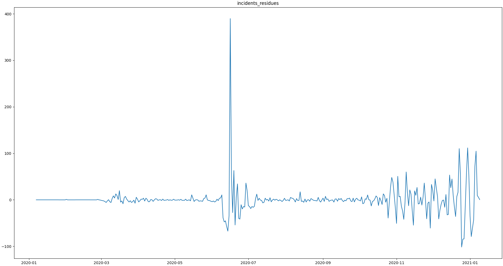

# Basic Outlier Flagging

## Data 

The [data set](https://git.ufz.de/rdm-software/saqc/-/blob/cookBux/sphinx-doc/ressources/data/incidentsLKG.csv) can be 
downloaded from the saqc git repository.

The data represents incidents of SARS-CoV-2 infections, on a daily basis, as reported by the 
[RKI](https://www.rki.de/DE/Home/homepage_node.html) in 2020. 


## Outlier

In June, an extreme spike can be observed. This spike relates to an incidence of so called "superspreading" in a local
[meat factory](https://www.heise.de/tp/features/Superspreader-bei-Toennies-identifiziert-4852400.html).
  
For the sake of modelling the spread of Covid, it can be of advantage, to filter the data for such extreme events, since
they may not be consistent with underlying distributional assumptions and thus interfere with the parameter learning 
process of the modelling.

To just introduce into some basic `SaQC` workflows, we will concentrate on classic variance based outlier detection approaches.

## Preparation
We, initially want to import the relevant packages. 

```python
import saqc
import pandas
import numpy as np
from scipy.signal import filtfilt, butter
import matplotlib.pyplot as plt
``` 

We include the data via pandas [csv file parser](https://pandas.pydata.org/docs/reference/api/pandas.read_csv.html). 
This will give us a [data frame](https://pandas.pydata.org/docs/reference/api/pandas.DataFrame.html) object, 
that we can directly feed into SaQC, in order to generate an SaQC object.

```python
import pandas as pd
# data path variable should point to where you have the incidents data set stored.
i_data = pd.read_csv(data_path)
i_data.index = pd.DatetimeIndex(i_data.index)
i_saqc = saqc.SaQC(data=i_data)
```

With evaluating :py:attr:`saqc.fields`, we can check out the variables, present in the data.

```python
>>> saqc.fields
['incidents']
```
So, the only data present, is the *incidents* dataset. We can have a look at the data and obtain the above plot through:
```python
>>> saqc.show('incidents')
```

## Modelling

First, we want to model our data, to obtain a stationary, residuish variable with zero mean.
Easiest thing to do, would be, to apply some rolling mean
model via the :py:func:`saqc.rolling <Functions.saqc.roll>` method.

```python
>>> i_saqc = i_saqc.rolling.roll(field='incidents', target='incidents_mean', func=np.mean, winsz='13D')
```

The `field` parameter is passed the variable name, we want to calculate the rolling mean of. 
The `target` parameter holds the name, we want to store the results of the calculation to. 
The `winsz` parameter controlls the size of the rolling window. It can be fed any so called [date alias](https://pandas.pydata.org/pandas-docs/stable/user_guide/timeseries.html#offset-aliases) string. We chose the rolling window to have a 13 days span.
You can pass arbitrary function objects to the `func` parameter, to be applied to calculate every single windows "score". 
For example, you could go for the `median` instead of the `mean`. The numpy library provides a [median](https://numpy.org/doc/stable/reference/generated/numpy.median.html) function
under the name `ǹp.median`. We just calculate another model curve for the `"incidents"` data with the `np.mean` function from the `numpy` library.

```python
>>> i_saqc = i_saqc.rolling.roll(field='incidents', target='incidents_median', func=np.median, winsz='13D')
```

We chose another target for the median calculation, to not override our results from the rolling mean calculation. 
The `target` parameter can be passed to any function. It will determine the result of the function to be written to the 
data under the fieldname specified by it. If there already exists a field with the name passed to `target`, the data stored to this field will be overridden.

Another common approach, is, to fit polynomials of certain degrees to the data. This could, of course, also be achieved 
by passing a function to the rolling method. Since this can get computationally expensive easily, for greater data sets, 
`SaQC` provides a build-in polynomial fit function: 
:py:func:`saqc.fitPolynomial <Functions.saqc.fitPolynomial>`:

```python
>>> i_saqc = i_saqc.fitPolynomial(field='incidents', target='incidents_polynomial', polydeg=2 ,winsz='13D')
```

If you want to apply a completely arbitrary function to your data, without pre-chunking it by a rolling window, 
you can make use of the more general :py:func:`saqc.processGeneric <Functions.saqc.process>` function.
Lets apply a smoothing filter from the [scipy.signal](https://docs.scipy.org/doc/scipy/reference/signal.html) 
module. We wrap the filter generator up into a function first:

```python
def butterFilter(x, filter_order, nyq, cutoff, filter_type):
    b, a = butter(N=filter_order, Wn=cutoff / nyq, btype=filter_type)
    return filtfilt(b, a, x)
```

Than we can pass it on to the :py:func:`saqc.processGeneric <Functions.saqc.process>` methods `func` argument. ([Here](sphinx-doc/getting_started_md/GenericFunctions.md) can
be found some more information on the generic Functions)

```python
i_saqc = i_saqc.processGeneric(field='incidents', target='incidents_lowPass', func=lambda x: butterFilter(x, cutoff=0.1, nyq=0.5, filter_order=2))
```

Now, we evaluate the data processings qeued to the saqc object, and return the results.

```python
>>> i_saqc = i_saqc.evaluate()
>>> result_data, _ saqc.getResult()
>>> result_data.plot()
```


## Residues calculation

We want to evaluate the residues of the model, in order to score the outlierish-nes of every point. 
First, we retrieve the residues via the :py:func:`saqc.generic.process <Functions.saqc.process>` method.
The method generates a new variable, resulting from the processing of other variables. It automatically
generates the field name it gets passed - so we do not have to generate new variable beforehand. The function we apply 
is just the computation of the variables difference for any timestep.

```python
i_saqc = i_saqc.generic.process('incidents_residues', func=lambda incidents, incidents_model:incidents - incidents_model)
```

Next, we score the residues simply by computing their [Z-scores](https://en.wikipedia.org/wiki/Standard_score).
The Z-score of a point $`x`$, relative to its surrounding $`D`$, evaluates to $`Z(x) = \frac{x - \mu(D)}{\sigma(D)}`$.

So, if we would like to roll with a window of a fixed size of 27 periods through the data and calculate the Z score for the point lying in the center of every window, we would define our function `z_score`:

```python
z_score = lambda D: abs((D[14] - np.mean(D)) / np.std(D)) 
```

And than do:

```python
i_saqc = i_saqc.rolling.roll(field='incidents_residues', target='incidents_scores', func=z_scores, winsz='13D')
```

The problem with this attempt, is, that it might get really slow for large data sets, because our function `z_scores` does not get decomposed into optimized building blocks - since it is a black box within `saqc`. Also, it relies on every window having a fixed number of values. otherwise, `D[14]` might not always be the value in the middle of the window, or it might not even exist, and an error will be thrown. 

If you want to accelerate your calculations and make them much more stable, it might be useful to decompose the scoring into seperate `rolling` calls. 

To make use of the fact, that `saqc`s rolling method trys to call optimized built-ins, and also, that it the return value of the rolling method is centered by default - we could calculate the series of the residues Mean and standard deviation seperately: 

```python
i_saqc = i_saqc.rolling.roll(field='incidents_residues', target='residues_mean', winsz='27D', 
                             func=np.mean)
i_saqc = i_saqc.rolling.roll(field='incidents_residues', target='residues_std', winsz='27D', 
                             func=np.std)
```
This will be noticably faster, since `saqc` dispatches the rolling with the basic numpy statistic methods to an optimized pandas built-in.
Also, as a result, all the values are centered and we dont have to care about window center indices, when we generate the *Z scores* form the series. 

```python
i_saqc = i_saqc.processGeneric(fields=['incidents_residues','incidents_mean','incidents_std'], target='incidents_scores', func=lambda x,y,z: abs((x-y) / z))
```

Lets evaluate the residues calculation and have a look at the resulting scores:
```python
i_saqc = i_saqc.evaluate()
i_saqc.show('incidents_scores')
```

## Setting Flag und unsetting Flags

We can now implement the common rule of thumb, that any Z-score value above 3, may indicate an outlierish data point, 
by applying the `saqc.flagRange <Functions.saqc.flagRange>` with:

```python
i_saqc = i_saqc.flagRange('incidents_scores', max=3).evaluate()
```

Now flags have been calculated for the scores:

```python
>>> i_saqc.show('incidents_scores')
```


We now can project those flags onto our original incidents timeseries:

```python
>>> i_saqc = i_saqc.flagGeneric(field=['incidents_scores'], target='incidents', func=lambda x: isFlagged(x))
```

Note, that we could have skipped the range flagging step, by including the lowpassing in our generic expression:

```python
>>> i_saqc = i_saqc.flagGeneric(field=['incidents_scores'], target='incidents', func=lambda x: x > 3)
```

Lets check the results:

```python
>>> i_saqc = i_saqc.evaluate()
>>> i_saqc.show('incidents')
```


Obveously, there are some flags set, that relate to minor incidents spikes relatively to there surrounding, but may not relate to global extreme values. Especially the left most flag seems not to relate to an extreme event at all. 
There are a lot of possibilities to tackle the issue. Lets look at the residues:
```python
>>> i_saqc.show('incidents_residues')
```


We could try to impose the additional condition, that an outlier must relate to a sufficiently large residue.

```python
>>> i_saqc.flagGeneric(field=['incidents','incidents_residues'], func=lambda x,y: isflagged(x) & (y < 200), flag=-np.inf)
```

Note, that we could have skipped the unflagging step as well, by including the minimum condition for the residues in 
the initial generic expression, via:

```python
>>> i_saqc = i_saqc.flagGeneric(field=['incidents_scores', 'incidents_residues'], target='incidents', func=lambda x, y: (x > 3) & (y < 200))
```

Now the flags result seems as intended:


