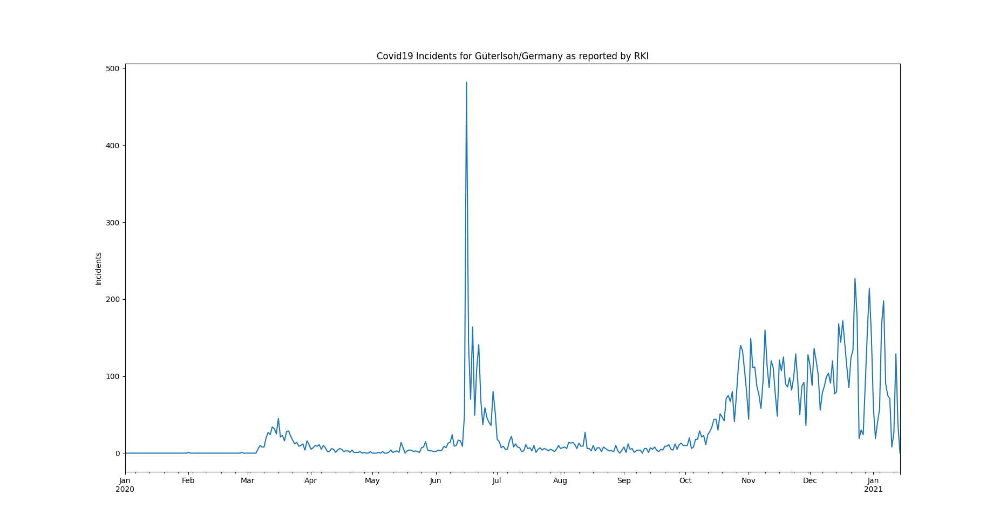
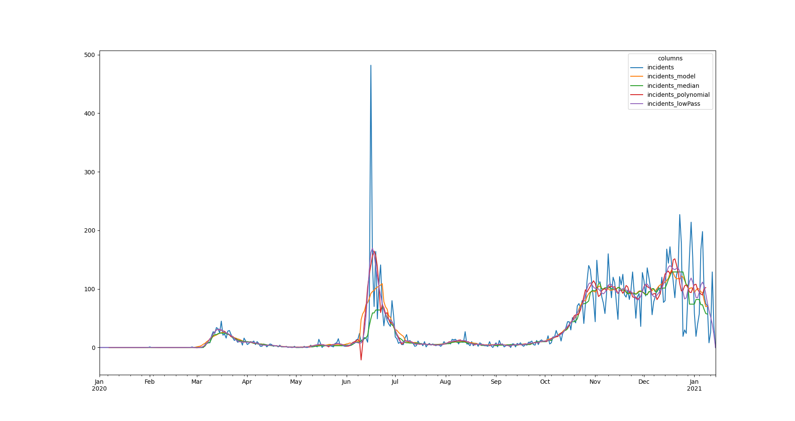

# Basic Outlier Detection Workflows

## Data 

The [data set](https://git.ufz.de/rdm-software/saqc/-/blob/cookBux/sphinx-doc/ressources/data/incidentsLKG.csv) can be 
downloaded from the saqc git repository.

The data represents incidents of SARS-CoV-2 infections, on a daily basis, as reported by the 
[RKI](https://www.rki.de/DE/Home/homepage_node.html) in 2020. 



## Outlier

In June, an extreme spike can be observed. This spike relates to an incidence of so called "superspreading" in a local
[meat factory](https://www.heise.de/tp/features/Superspreader-bei-Toennies-identifiziert-4852400.html).
  
For the sake of modelling the Corona disease, it can be of advantage, to filter the data for such extreme events, since
they may not be consistent with underlying distributional assumptions and thus interfere with the parameter learning 
process of the modelling.

To just introduce into some basic `SaQC` workflows, we will concentrate on classic variance based outlier detection 
approaches.

## Preparation
We, initially want to import the relevant packages. 

```python
import saqc
import pandas
import numpy as np
from scipy.signal import filtfilt, butter
import matplotlib.pyplot as plt
``` 

We include the data via pandas [csv file parser](https://pandas.pydata.org/docs/reference/api/pandas.read_csv.html). 
This will give us a [data frame](https://pandas.pydata.org/docs/reference/api/pandas.DataFrame.html) object, 
that we can directly feed into SaQC, in order to generate an SaQC object.

```python
import pandas as pd
# data path variable should point to where you have the incidents data set stored.
i_data = pd.read_csv(data_path)
i_data.index = pd.DatetimeIndex(i_data.index)
i_saqc = saqc.SaQC(data=i_data)
``` 

## Modelling

First, we want to model our data, to obtain a stationary, residuish variable with zero mean.
In SaQC, the results of data processing functions, defaultly overrides the processed data column. 
So, if we want to transform our input data and reuse the original data later on, we need to duplicate 
it first, with the :py:func:`saqc.tools.copy <docs.func_modules.outliers.flagRange>` method:

```python
i_saqc = i_saqc.tools.copy(field='incidents', new_field='incidents_model')
```

The copy method has 2 parameters - the `field` parameter controlls the name of the variable to
copy, the `new_field` parameter holds the new column name of the duplicated variable. 

Easiest thing to do, would be to apply some rolling mean
model via the :py:func:`saqc.rolling.roll <docs.func_modules.rolling.roll>` method.

```python
i_saqc = i_saqc.rolling.roll(field='incidents_model', func=np.mean, window='13D')
```

We chose the rolling window to have a sice of 13 days.
You can pass arbitrary functions to the rolling method. for example, you could go for the 
`median` instead. this would be done via:

```python
i_saqc = i_saqc.tools.copy(field='incidents', new_field='incidents_median')
i_saqc = i_saqc.rolling.roll(field='incidents_median', func=np.median, window='13D')
```

Another common approach, is, to fit polynomials of certain degrees to the data. This could, of course, also be applied 
via a functions passed to the rolling method - since this can get computationally expensive easily, for greater data sets, 
SaQC offers a build-in polynomial fit function 
:py:func:`saqc.curvefit.fitPolynomial <docs.func_modules.curvefit.fitPolynomial>`:

```python
i_saqc = i_saqc.tools.copy(field='incidents', new_field='incidents_polynomial')
i_saqc = i_saqc.curvefit.fitPolynomial(field='incidents_polynomial', order=2,
                                       winsz='13D')
```

If you want to apply a completely arbitrary function to your data, without rolling, for example
a smoothing filter from the [scipy.signal](https://docs.scipy.org/doc/scipy/reference/signal.html) 
module, you would simply have to wrap the desired function up into a function of a single
array-like variable. To wrap the scipy butterworth filter into a forward-backward application,
you would need to define a function:

```python
def butterFilter(x, filter_order, nyq, cutoff, filter_type):
    b, a = butter(N=filter_order, Wn=cutoff / nyq, btype=filter_type)
    return filtfilt(b, a, x)
```

Than you can wrap it up with a lambda function and pass it to the 
:py:func:`saqc.transformation.transform <docs.func_modules.transformation.transform>` 
methods func argument.

```python
func=lambda x: butterFilter(x, cutoff=0.1, nyq=0.5, filter_order=2)
i_saqc = i_saqc.tools.copy(field='incidents', new_field='incidents_lowPass')
i_saqc = i_saqc.transformation.transform(field='incidents_lowPass',func=func)
```

You can check out the modelling results. Therefor we evaluate the qeued manipualations to the saqc object and return the 
results.

```python
i_saqc = i_saqc.evaluate()
result_data, _ saqc.getResult()
result_data.plot()
```



## Residues calculation

We want to evaluate the residues of the model, in order to score the outlierish-nes of every point. 
First, we retrieve the residues via the :py:func:`saqc.genericProcess <docs.func_modules.genericProcess>` method.
The method generates a new variable, resulting from the processing of other variables. It automatically
generates the field name it gets passed - so we do not have to generate new variable beforehand. The function we apply 
is just the computation of the variables difference for any timestep.

```python
i_saqc = i_saqc.genericProcess('incidents_residues', func=lambda incidents, incidents_model:incidents - incidents_model)
```

Next, we score the residues simply by computing their [Z-scores](https://en.wikipedia.org/wiki/Standard_score).

```python
i_saqc = i_saqc.rolling.roll(field='incidents_residues', target='residues_mean',
                             window='27D',
                             func=np.mean)
i_saqc = i_saqc.rolling.roll(field='incidents_residues', target='residues_std',
                             window='27D',
                             func=np.std)
i_saqc = i_saqc.genericProcess(field='incidents_scores',
                                func=lambda This, residues_mean, residues_std: (
                                                                                           This - residues_mean) / residues_std)
```


