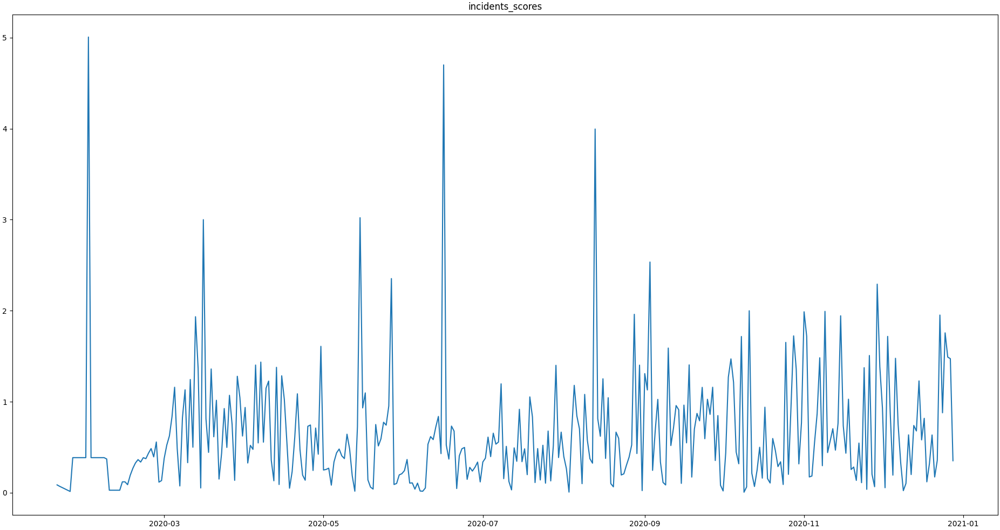
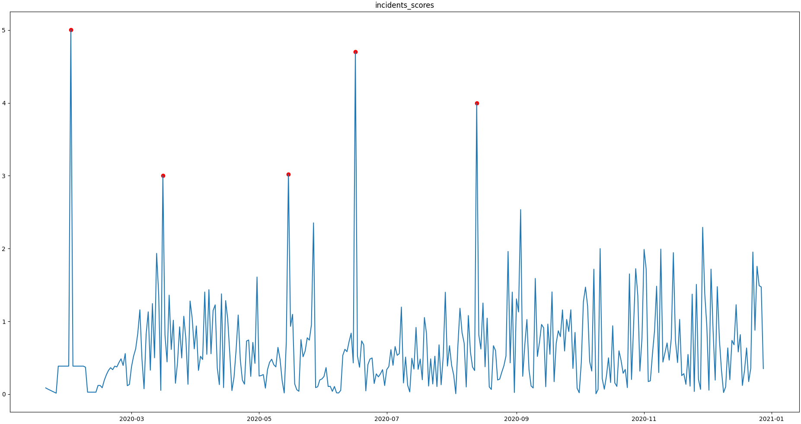
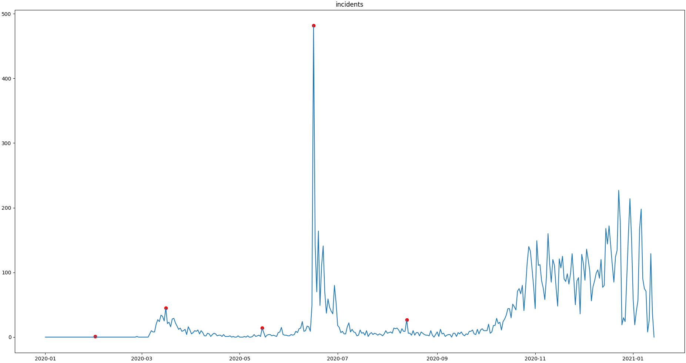
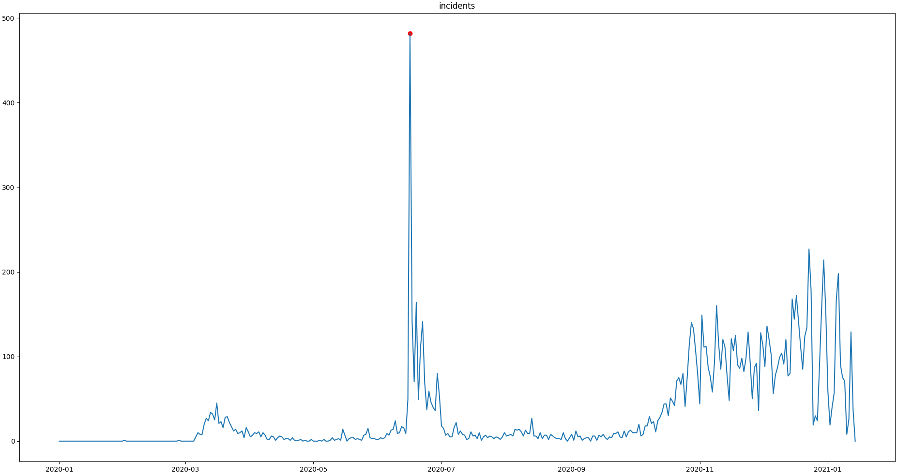

Outlier Detection and Flagging
==============================

The tutorial aims to introduce the usage of ``saqc`` methods in order to detect outliers in an uni-variate set up.
The tutorial guides through the following steps:

#. We checkout and load the example data set. Subsequently, we initialise an :py:class:`SaQC <saqc.core.core.SaQC>` object.

   * :ref:`Preparation <cook_books_md_m2r/OutlierDetection:Preparation>`

     * :ref:`Data <cook_books_md_m2r/OutlierDetection:Data>`
     * :ref:`Initialisation <cook_books_md_m2r/OutlierDetection:Initialisation>`

#. 
   We will see how to apply different smoothing methods and models to the data in order to obtain usefull residue 
   variables.

   * :ref:`Modelling <cook_books_md_m2r/OutlierDetection:Modelling>`

     * :ref:`Rolling Mean <cook_books_md_m2r/OutlierDetection:Rolling Mean>`
     * :ref:`Rolling Median <cook_books_md_m2r/OutlierDetection:Rolling Median>`
     * :ref:`Polynomial Fit <cook_books_md_m2r/OutlierDetection:Polynomial Fit>`
     * :ref:`Custom Models <cook_books_md_m2r/OutlierDetection:Custom Models>`

   * :ref:`Evaluation and Visualisation <cook_books_md_m2r/OutlierDetection:Evaluation and Visualisation>`

#. 
   We will see how we can obtain residues and scores from the calculated model curves. 

   * :ref:`Residues and Scores <cook_books_md_m2r/OutlierDetection:Residues and Scores>`

     * :ref:`Residues <cook_books_md_m2r/OutlierDetection:Residues>`
     * :ref:`Scores <cook_books_md_m2r/OutlierDetection:Scores>`
     * :ref:`Optimization from Decomposition <cook_books_md_m2r/OutlierDetection:Optimization from Decomposition>`

#. 
   Finally, we will see how to derive flags from the scores itself and impose additional conditions, functioning as 
   correctives.

   * :ref:`Setting and Correcting Flags <cook_books_md_m2r/OutlierDetection:Setting and Correcting Flags>`

     * :ref:`Flagging the Scores <cook_books_md_m2r/OutlierDetection:Flagging the Scores>`
     * `Additional Conditions ("unflagging") <#Additional-Conditions>`_
     * :ref:`Including Multiple Conditions <cook_books_md_m2r/OutlierDetection:Including Multiple Conditions>`

Preparation
-----------

Data
^^^^

The example `data set <https://git.ufz.de/rdm-software/saqc/-/blob/cookBux/sphinx-doc/ressources/data/incidentsLKG.csv>`_
is selected to be small, comprehendable and its single anomalous outlier
can be identified easily visually: 

.. image:: ../ressources/images/cbooks_incidents1.png
   :target: ../ressources/images/cbooks_incidents1.png
   :alt: 

It can be downloaded from the saqc git `repository <https://git.ufz.de/rdm-software/saqc/-/blob/cookBux/sphinx-doc/ressources/data/incidentsLKG.csv>`_.

The data represents incidents of SARS-CoV-2 infections, on a daily basis, as reported by the 
`RKI <https://www.rki.de/DE/Home/homepage_node.html>`_ in 2020.

In June, an extreme spike can be observed. This spike relates to an incidence of so called "superspreading" in a local
`meat factory <https://www.heise.de/tp/features/Superspreader-bei-Toennies-identifiziert-4852400.html>`_.

For the sake of modelling the spread of Covid, it can be of advantage, to filter the data for such extreme events, since
they may not be consistent with underlying distributional assumptions and thus interfere with the parameter learning 
process of the modelling. Also it can help to learn about the conditions severely facilitating infection rates.

To introduce into some basic ``SaQC`` workflows, we will concentrate on classic variance based outlier detection approaches.

Initialisation
^^^^^^^^^^^^^^

We initially want to import the data into our workspace. Therefore we import the `pandas <https://pandas.pydata.org/>`_
library and use its csv file parser `pd.read_csv <https://pandas.pydata.org/docs/reference/api/pandas.read_csv.html>`_. 

.. code-block:: python

   import pandas as pd
   i_data = pd.read_csv(data_path)

The resulting ``i_data`` variable is a pandas `data frame <https://pandas.pydata.org/docs/reference/api/pandas.DataFrame.html>`_
object. We can generate an SaQC object directly from that. Beforehand we have to make sure, the index
of ``ì_data`` is of the right type. 

.. code-block:: python

   i_data.index = pd.DatetimeIndex(i_data.index)

Now we do load the saqc package into the workspace and generate an instance of ``saqc <saqc.core.core.SaQC>`` object,
that refers to the loaded data.

.. code-block:: python

   import saqc
   i_saqc = saqc.SaQC(i_data)

With evaluating :py:attr:`saqc.fields`, we can check out the variables, present in the data.

.. code-block:: python

   >>> saqc.fields
   ['incidents']

So, the only data present, is the *incidents* dataset. We can have a look at the data and obtain the above plot through
the method :py:meth:`saqc.show <saqc.core.core.SaQC.show>`:

.. code-block:: python

   >>> saqc.show('incidents')

Modelling
---------

First, we want to model our data in order to obtain a stationary, residuish variable with zero mean. 

Rolling Mean
^^^^^^^^^^^^

Easiest thing to do, would be, to apply some rolling mean
model via the method :py:func:`saqc.roll <Functions.saqc.roll>`.

.. code-block:: python

   <<<<<<< HEAD
   >>> i_saqc = i_saqc.roll(field='incidents', target='incidents_mean', func=np.mean, winsz='13D')
   =======
   i_saqc = i_saqc.rolling.roll(field='incidents_model', func=np.mean, window='13D')
   >>>>>>> develop

The :py:attr:`field` parameter is passed the variable name, we want to calculate the rolling mean of. 
The :py:attr:`target` parameter holds the name, we want to store the results of the calculation to. 
The :py:attr:`winsz` parameter controlls the size of the rolling window. It can be fed any so called `date alias <https://pandas.pydata.org/pandas-docs/stable/user_guide/timeseries.html#offset-aliases>`_ string. We chose the rolling window to have a 13 days span.

Rolling Median
^^^^^^^^^^^^^^

You can pass arbitrary function objects to the :py:attr:`func` parameter, to be applied to calculate every single windows "score". 
For example, you could go for the *median* instead of the *mean*. The numpy library provides a `median <https://numpy.org/doc/stable/reference/generated/numpy.median.html>`_ function
under the name ``ǹp.median``. We just calculate another model curve for the ``"incidents"`` data with the ``np.median`` function from the ``numpy`` library.

.. code-block:: python

   <<<<<<< HEAD
   >>> i_saqc = i_saqc.roll(field='incidents', target='incidents_median', func=np.median, winsz='13D')
   =======
   i_saqc = i_saqc.tools.copy(field='incidents', new_field='incidents_median')
   i_saqc = i_saqc.rolling.roll(field='incidents_median', func=np.median, window='13D')
   >>>>>>> develop

We chose another :py:attr:`target` value for the rolling *median* calculation, in order to not override our results from 
the previous rolling *mean* calculation. 
The :py:attr:`target` parameter can be passed to any call of a function from the 
saqc functions pool and will determine the result of the function to be written to the 
data, under the fieldname specified by it. If there already exists a field with the name passed to ``target``\ , 
the data stored to this field will be overridden.

We will evaluate and visualize the different model curves :ref:`later <cook_books_md_m2r/OutlierDetection:Evaluation and Visualisation>`. 
Beforehand, we will generate some more model data.

Polynomial Fit
^^^^^^^^^^^^^^

Another common approach, is, to fit polynomials of certain degrees to the data.
:py:class:`SaQC <saqc.core.core.SaQC>` provides the polynomial fit function :py:func:`saqc.fitPolynomial <Functions.saqc.fitPolynomial>`:

.. code-block:: python

   <<<<<<< HEAD
   >>> i_saqc = i_saqc.fitPolynomial(field='incidents', target='incidents_polynomial', polydeg=2 ,winsz='13D')
   =======
   i_saqc = i_saqc.tools.copy(field='incidents', new_field='incidents_polynomial')
   i_saqc = i_saqc.curvefit.fitPolynomial(field='incidents_polynomial', order=2,
                                          winsz='13D')
   >>>>>>> develop

It also takes a :py:attr:`winsz` parameter, determining the size of the fitting window. 
The parameter, :py:attr:`polydeg` refers to the size of the rolling window, the polynomials get fitted to.

Custom Models
^^^^^^^^^^^^^

If you want to apply a completely arbitrary function to your data, without pre-chunking it by a rolling window, 
you can make use of the more general :py:func:`saqc.processGeneric <Functions.saqc.process>` function. 

Lets apply a smoothing filter from the `scipy.signal <https://docs.scipy.org/doc/scipy/reference/signal.html>`_ 
module. We wrap the filter generator up into a function first:

.. code-block:: python

   from scipy.signal import filtfilt, butter

   def butterFilter(x, filter_order, nyq, cutoff, filter_type):
       b, a = butter(N=filter_order, Wn=cutoff / nyq, btype=filter_type)
       return filtfilt(b, a, x)

This function object, we can pass on to the :py:func:`saqc.processGeneric <Functions.saqc.process>` methods :py:attr:`func` argument. 
(\ :doc:`Here <../getting_started_md_m2r/GenericFunctions>` can
be found some more information on the generic Functions)

.. code-block:: python

   i_saqc = i_saqc.processGeneric(field='incidents', target='incidents_lowPass', func=lambda x: butterFilter(x, cutoff=0.1, nyq=0.5, filter_order=2))

Evaluation and Visualisation
----------------------------

Now, we can evaluate the data processing functions qeued to the :py:class:`SaQC <saqc.core.core.SaQC>` object with the 
:py:func:`saqc.evaluate <saqc.core.core.SaQC.evaluate>` method.

.. code-block:: python

   >>> i_saqc = i_saqc.evaluate()

This will give us an updated :py:class:`SaQC <saqc.core.core.SaQC>` object, in wich the internal data informations
are updated according to the methods we stacked to be applied. 
We can obtain those updated informations by generating a `pandas dataframe <https://pandas.pydata.org/docs/reference/api/pandas.DataFrame.html>`_
representation of it, with the :py:meth:`saqc.getResult <saqc.core.core.SaQC.getResult>` method: 

.. code-block:: python

   >>> data = i_saqc.getResult()[0]

To see all the results obtained so far, plotted in one figure window, we make use of the dataframes `plot <https://pandas.pydata.org/docs/reference/api/pandas.DataFrame.plot.html>`_ method.

.. code-block:: python

   >>> data.plot()

.. image:: ../ressources/images/cbooks_incidents2.png
   :target: ../ressources/images/cbooks_incidents2.png
   :alt: 

Residues and Scores
-------------------

Residues
^^^^^^^^

We want to evaluate the residues of one of our models model, in order to score the outlierish-nes of every point. 
Therefor we just stick to the initially calculated rolling mean curve.  

First, we retrieve the residues via the :py:func:`saqc.processGeneric <Functions.saqc.process>` method.
This method always comes into play, when we want to obtain variables, resulting from basic algebraic
manipulations of one or more input variables. 

For obtaining the models residues, we just subtract the model data from the original data and assign the result
of this operation to a new variable, called ``incidents_residues``. This Assignment, we, as usual,
control via the :py:attr:`target` parameter.

.. code-block:: python

   i_saqc = i_saqc.procesGeneric(['incidents', 'incidents_model'], target='incidents_residues', func=lambda x, y: x - y)

Scores
^^^^^^

Next, we score the residues simply by computing their `Z-scores <https://en.wikipedia.org/wiki/Standard_score>`_.
The Z-score of a point $\ ``x``\ $, relative to its surrounding $\ ``D``\ $, evaluates to $\ ``Z(x) = \frac{x - \mu(D)}{\sigma(D)}``\ $.

So, if we would like to roll with a window of a fixed size of *27* periods through the data and calculate the *Z*\ -score 
for the point lying in the center of every window, we would define our function ``z_score``\ :

.. code-block:: python

   z_score = lambda D: abs((D[14] - np.mean(D)) / np.std(D))

And subsequently, use the :py:func:`saqc.roll <Functions.saqc.roll>` method to make a rolling window application with the scoring 
function:

.. code-block:: python

   i_saqc = i_saqc.roll(field='incidents_residues', target='incidents_scores', func=z_scores, winsz='13D')

Optimization by Decomposition
^^^^^^^^^^^^^^^^^^^^^^^^^^^^^

There are 2 problems with the attempt presented :ref:`above <cook_books_md_m2r/OutlierDetection:Scores>`. 

First, the rolling application of the customly 
defined function, might get really slow for large data sets, because our function ``z_scores`` does not get decomposed into optimized building blocks. 

Second, and maybe more important, it relies heavily on every window having a fixed number of values and a fixed temporal extension. 
Otherwise, ``D[14]`` might not always be the value in the middle of the window, or it might not even exist, 
and an error will be thrown.

So the attempt works fine, only because our data set is small and strictly regularily sampled. 
Meaning that it has constant temporal distances between subsequent meassurements.

In order to tweak our calculations and make them much more stable, it might be useful to decompose the scoring 
into seperate calls to the :py:func: ``saqc.roll <Functions.saqc.roll>`` function, by calculating the series of the 
residues *mean* and *standard deviation* seperately:

.. code-block:: python

   i_saqc = i_saqc.rolling.roll(field='incidents_residues', target='residues_mean',
                                window='27D',
                                func=np.mean)
   i_saqc = i_saqc.rolling.roll(field='incidents_residues', target='residues_std',
                                window='27D',
                                func=np.std)
   i_saqc = i_saqc.generic.process(field='incidents_scores',
                                   func=lambda This, residues_mean, residues_std: (
                                                                                              This - residues_mean) / residues_std)

With huge datasets, this will be noticably faster, compared to the method presented :ref:`initially <cook_books_md_m2r/OutlierDetection:Scores>`\ , 
because ``saqc`` dispatches the rolling with the basic numpy statistic methods to an optimized pandas built-in.

Also, as a result of the :py:func: ``saqc.roll <Functions.saqc.roll>`` assigning its results to the center of every window, 
all the values are centered and we dont have to care about window center indices when we are generating 
the *Z*\ -Scores from the two series. 

We simply combine them via the
:py:func:`saqc.processGeneric <Functions.saqc.generic>` method, in order to obtain the scores:

.. code-block:: python

   i_saqc = i_saqc.processGeneric(fields=['incidents_residues','incidents_mean','incidents_std'], target='incidents_scores', func=lambda x,y,z: abs((x-y) / z))

Lets evaluate the residues calculation and have a look at the resulting scores:

.. code-block:: python

   i_saqc = i_saqc.evaluate()
   i_saqc.show('incidents_scores')

Setting and correcting Flags
----------------------------

Flagging the Scores
^^^^^^^^^^^^^^^^^^^

We can now implement the common `rule of thumb <https://en.wikipedia.org/wiki/68%E2%80%9395%E2%80%9399.7_rule>`_\ , 
that any *Z*\ -score value above *3* may indicate an outlierish data point, 
by applying the :py:func:`saqc.flagRange <Functions.saqc.flagRange>` method with a :py:attr:`max` value of *3*.

.. code-block:: python

   i_saqc = i_saqc.flagRange('incidents_scores', max=3).evaluate()

Now flags have been calculated for the scores:

.. code-block:: python

   >>> i_saqc.show('incidents_scores')

Projecting Flags
^^^^^^^^^^^^^^^^

We now can project those flags onto our original incidents timeseries:

.. code-block:: python

   >>> i_saqc = i_saqc.flagGeneric(field=['incidents_scores'], target='incidents', func=lambda x: isFlagged(x))

Note, that we could have skipped the :ref:`range flagging step <cook_books_md_m2r/OutlierDetection:Flagging the scores>`\ , by including the cutting off in our 
generic expression:

.. code-block:: python

   >>> i_saqc = i_saqc.flagGeneric(field=['incidents_scores'], target='incidents', func=lambda x: x > 3)

Lets check out the results:

.. code-block:: python

   >>> i_saqc = i_saqc.evaluate()
   >>> i_saqc.show('incidents')

Obveously, there are some flags set, that, relative to their 13 days surrounding, might relate to minor incidents spikes,
but may not relate to superspreading events we are looking for. 

Especially the left most flag seems not to relate to an extreme event at all. 
This overflagging stems from those values having a surrounding with very low data variance, and thus, evaluate to a relatively high Z-score.

There are a lot of possibilities to tackle the issue. In the next section, we will see how we can improve the flagging results 
by incorporating additional domain knowledge.

Additional Conditions
---------------------

In order to improve our flagging result, we could additionally assume, that the events we are interested in, 
are those with an incidents count that is deviating by a margin of more than
*20* from the 2 week average. 

This is equivalent to imposing the additional condition, that an outlier must relate to a sufficiently large residue.

Unflagging
^^^^^^^^^^

We can do that posterior to the preceeding flagging step, by *removing* 
some flags based on some condition. 

In orer want to *unflag* those values, that do not relate to 
sufficiently large residues, we assign them the :py:const:`unflagged <saqc.constants.UNFLAGGED>` flag. 

Therefore, we make use of the :py:func:`saqc.flagGeneric <Functions.saqc.flag>` method. 
This method usually comes into play, when we want to assign flags based on the evaluation of logical expressions.

So, we check out, which residues evaluate to a level below *20*\ , and assign the 
flag value for :py:const:`unflagged <saqc.constants.UNFLAGGED>`. This value defaults to
to ``-np.inf`` in the default translation scheme, wich we selected implicitly by not specifying any special scheme in the 
generation of the :py:class:`SaQC <saqc.core.core.SaQC>` object in the :ref:`beginning <cook_books_md_m2r/OutlierDetection:Initialisation>`.

.. code-block:: python

   >>> i_saqc = i_saqc.flagGeneric(field=['incidents','incidents_residues'], func=lambda x,y: isflagged(x) & (y < 50), flag=-np.inf)

Notice, that we passed the desired flag level to the :py:attr:`flag` keyword in order to perform an
"unflagging" instead of the usual flagging. The :py:attr:`flag` keyword can be passed to all the functions
and defaults to the selected translation schemes :py:const:`bad <saqc.constants.BAD>` flag level. 

Evaluation and showing proofs the tweaking did in deed improve the flagging result:

.. code-block:: python

   >>> i_saqc = i_saqc.evaluate()
   >>> i_saqc.show()

Including multiple Conditions
^^^^^^^^^^^^^^^^^^^^^^^^^^^^^

If we do not want to first set flags, only to remove the majority of them in the next step, we also
could circumvent the :ref:`unflagging <cook_books_md_m2r/OutlierDetection:Unflagging>` step, by adding to the call to :py:func:`saqc.flagRange <Functions.saqc.flagRange>` the condition for the residues having to be above *20*

.. code-block:: python

   >>> i_saqc = i_saqc.flagGeneric(field=['incidents_scores', 'incidents_residues'], target='incidents', func=lambda x, y: (x > 3) & (y > 20))
   >>> i_saqc = i_saqc.evaluate()
   >>> i_saqc.show()

