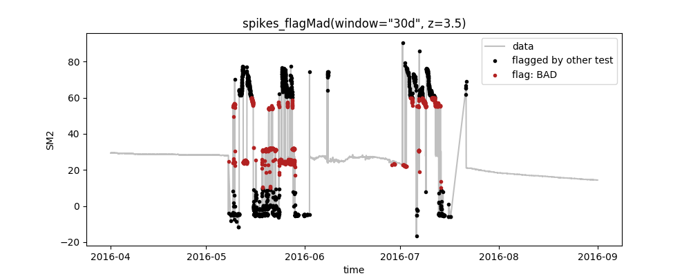
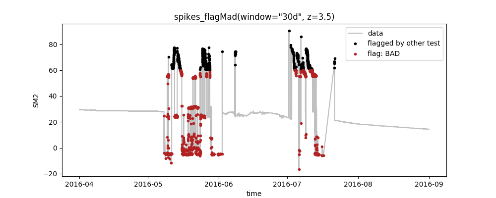
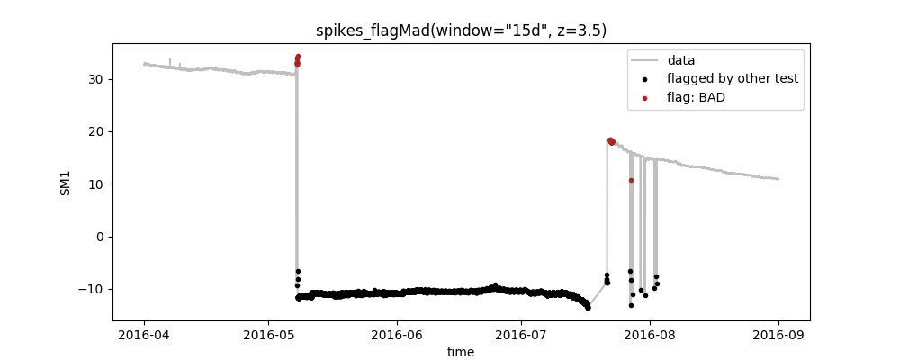
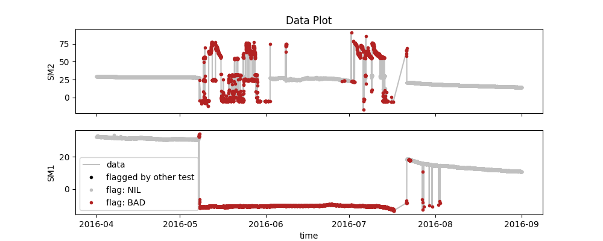
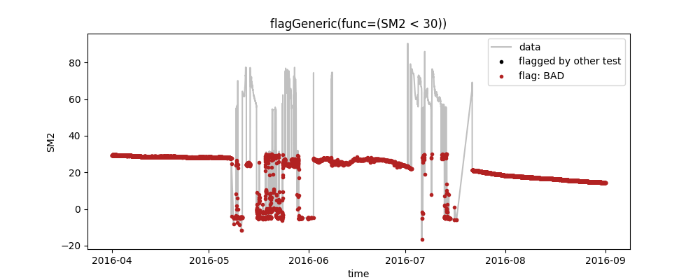

# Getting started with SaQC

Requirements: this tutorial assumes that you have Python version 3.6.1 or newer
installed, and that both your operating system and Python version are in 64-bit.

## Contents

1. [Set up your environment](#1-set-up-your-environment)
2. [Get SaQC](#2-get-saqc)
3. [Training tour](#3-training-tour) 
	* [3.1 Get toy data and configuration](#get-toy-data-and-configuration)
	* [3.2 Run SaQC](#run-saqc)
	* [3.3 Configure SaQC](#configure-saqc)
	    * [Change test parameters](#change-test-parameters)
	* [3.4 Explore the functionality](#explore-the-functionality)
		* [Process multiple variables](#process-multiple-variables)
		* [Data harmonization and custom functions](#data-harmonization-and-custom-functions)
		* [Save outputs to file](#save-outputs-to-file)


## 1. Set up your environment

SaQC is written in Python, so the easiest way to set up your system to use SaQC
for your needs is using the Python Package Index (PyPI). Following good Python
practice, you will first want to create a new virtual environment that you
install SaQC into by typing the following in your console:


##### On Unix/Mac-systems

```sh
# if you have not installed venv yet, do so:
python3 -m pip install --user virtualenv
	
# move to the directory where you want to create your virtual environment
cd YOURDIR
	
# create virtual environment called "env_saqc"
python3 -m venv env_saqc

# activate the virtual environment
source env_saqc/bin/activate
```

##### On Windows-systems

```sh	
# if you have not installed venv yet, do so:
py -3 -m pip install --user virtualenv
	
# move to the directory where you want to create your virtual environment
cd YOURDIR
	
# create virtual environment called "env_saqc"
py -3 -m venv env_saqc

# move to the Scripts directory in "env_saqc"
cd env_saqc/Scripts

# activate the virtual environment
./activate
```

## 2. Get SaQC

### Via PyPI

Type the following:

##### On Unix/Mac-systems


```sh
python3 -m pip install saqc
```

##### On Windows-systems


```sh
py -3 -m pip install saqc
```


### From Gitlab repository

Download SaQC directly from the [GitLab-repository](https://git.ufz.de/rdm/saqc) to make sure you use the most recent version:

```sh
# clone gitlab - repository
git clone https://git.ufz.de/rdm-software/saqc

# switch to the folder where you installed saqc
cd saqc 

# install all required packages 
pip install -r requirements.txt

# install all required submodules
git submodule update --init --recursive 
```


## 3. Training tour

The following passage guides you through the essentials of the usage of SaQC via
a toy dataset and a toy configuration.

### Get toy data and configuration

If you take a look into the folder `saqc/ressources/data` you will find a toy
dataset `data.csv` which contains the following:

	Date,Battery,SM1,SM2
	2016-04-01 00:05:48,3573,32.685,29.3157
	2016-04-01 00:20:42,3572,32.7428,29.3157
	2016-04-01 00:35:37,3572,32.6186,29.3679
	2016-04-01 00:50:32,3572,32.736999999999995,29.3679
	...

These are two timeseries of soil moisture (SM1+2) and the battery voltage of the
measuring device over time. Generally, this is the way that your data should
look like to run saqc. Note, however, that you do not necessarily need a series
of dates to reference to and that you are free to use more columns of any name
that you like.

Now create your our own configuration file `saqc/ressources/data/myconfig.csv`
and paste the following lines into it:
	
	varname;test;plot
	SM2;flagRange(min=10, max=60);False
	SM2;flagMad(window="30d", z=3.5);True

These lines illustrate how different quality control tests can be specified for
different variables by following the pattern:

*varname*|;| *testname (testparameters)*|;| *plotting option*|
:---------------|:------|:------|:----|:--|

In this case, we define a range-test that flags all values outside the range
[10,60] and a test to detect spikes using the MAD-method. You can find an
overview of all available quality control tests in the
[documentation](FunctionIndex.md). Note that the tests are
_executed in the order that you define in the configuration file_. The quality
flags that are set during one test are always passed on to the subsequent one.

### Run SaQC

Remember to have your virtual environment activated:

##### On Unix/Mac-systems

```sh
source env_saqc/bin/activate
```

##### On Windows

```sh
cd env_saqc/Scripts
./activate
```


Via your console, move into the folder you downloaded saqc into:
```sh
cd saqc
```

From here, you can run saqc and tell it to run the tests from the toy
config-file on the toy dataset via the `-c` and `-d` options:
##### On Unix/Mac-systems
```sh
python3 -m saqc -c ressources/data/myconfig.csv -d ressources/data/data.csv
```
##### On Windows
```sh
py -3 -m saqc -c ressources/data/myconfig.csv -d ressources/data/data.csv
```

If you installed saqc via PYPi, you can omit ```sh python -m```.

The command will output this plot:



So, what do we see here?

* The plot shows the data as well as the quality flags that were set by the
  tests for the variable `SM2`, as defined in the config-file
* Following our definition in the config-file, first the `flagRange`-test that flags
  all values outside the range [10,60] was executed and after that,
  the `flagMad`-test to identify spikes in the data
* In the config, we set the plotting option to `True` for `flagMad`,
  only. Thus, the plot aggregates all preceeding tests (here: `range`) to black
  points and highlights the flags of the selected test as red points.


#### Save outputs to file
If you want the final results to be saved to a csv-file, you can do so by the
use of the `-o` option:

```sh
saqc -c ressources/data/config.csv -d ressources/data/data.csv -o ressources/data/out.csv 
```

Which saves a dataframe that contains both the original data and the quality
flags that were assigned by SaQC for each of the variables:

	Date,SM1,SM1_flags,SM2,SM2_flags
	2016-04-01 00:05:48,32.685,OK,29.3157,OK
	2016-04-01 00:20:42,32.7428,OK,29.3157,OK
	2016-04-01 00:35:37,32.6186,OK,29.3679,OK
	2016-04-01 00:50:32,32.736999999999995,OK,29.3679,OK
	...


### Configure SaQC

#### Change test parameters
Now you can start to change the settings in the config-file and investigate the
effect that has on how many datapoints are flagged as "BAD". When using your
own data, this is your way to configure the tests according to your needs. For
example, you could modify your `myconfig.csv` and change the parameters of the
range-test:
	
	varname;test;plot
	SM2;flagRange(min=-20, max=60);False
	SM2;flagMad(window="30d", z=3.5);True
Rerunning SaQC as above produces the following plot:



You can see that the changes that we made to the parameters of the range test
take effect so that only the values > 60 are flagged by it (black points). This,
in turn, leaves more erroneous data that is then identified by the proceeding
spike-test (red points).

### Explore the functionality
#### Process multiple variables
You can also define multiple tests for multiple variables in your data. These
are then executed sequentially and can be plotted seperately. E.g. you could do
something like this:

	varname;test;plot
	SM1;flagRange(min=10, max=60);False
	SM2;flagRange(min=10, max=60);False
	SM1;flagMad(window="15d", z=3.5);True
	SM2;flagMad(window="30d", z=3.5);True

which gives you separate plots for each line where the plotting option is set to
`True` as well as one summary "data plot" that depicts the joint flags from all
tests:

|SM1         |  SM2 |
|:-------------------------:|:-------------------------:|
|here  |  there|


|SM1         |  SM2 |
|:-------------------------:|:-------------------------:|
|   | |
|   | bumm|



#### Data harmonization and custom functions

SaQC includes functionality to harmonize the timestamps of one or more data
series. Also, you can write your own tests using a python-based
[extension language](sphinx-doc/getting_started_md/GenericFunctions.md). This would look like this:

	varname;test;plot
	SM2;shiftToFreq(freq="15Min");False
	SM2;generic(func=(SM2 < 30));True

The above executes an internal framework that harmonizes the timestamps of SM2
to a 15min-grid (see data below). Further information about this routine can be
found in the :ref:`Flagging Functions Overview <flaggingFunctions>`.

	Date,SM1,SM1_flags,SM2,SM2_flags
	2016-04-01 00:00:00,,,29.3157,OK
	2016-04-01 00:05:48,32.685,OK,,
	2016-04-01 00:15:00,,,29.3157,OK
	2016-04-01 00:20:42,32.7428,OK,,
	...

Also, all values where SM2 is below 30 are flagged via the custom function (see
plot below). You can learn more about the syntax of these custom functions
[here](sphinx-doc/getting_started_md/GenericFunctions.md).



:py:func:`lala <docs.func_modules.outliers.flagRange>`